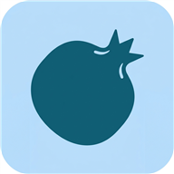

# 🍎 Anar X

<p align="center">
  
</p>

<h1 align="center">Anar X</h1>

<p align="center">
  <b>AI-powered pomegranate disease detection and farm intelligence</b>
</p>

<p align="center">
  An on-device agriculture application combining deep learning,
  computer vision, edge AI, and agricultural data to assist
  pomegranate farmers.
</p>

<p align="center">

  <a href="#features">Features</a>
  &nbsp; • &nbsp;
  <a href="#ai-architecture">AI Architecture</a>
  &nbsp; • &nbsp;
  <a href="#dataset">Dataset</a>
  &nbsp; • &nbsp;
  <a href="#setup">Setup</a>

</p>

---

# 🌱 Overview

**Anar X** is an AI-powered agriculture application designed around one problem:

> **How can a farmer get useful crop intelligence directly from a smartphone without depending completely on cloud services?**

The project focuses on **pomegranate cultivation in Maharashtra**, combining an on-device disease detection model with severity estimation, farming assistance, yield estimation, weather information, market prices, and farm-management tools.

The core disease-detection system runs directly on the Android device using **TensorFlow Lite**, allowing image inference without requiring a network connection.

The project combines:

- 🧠 Multi-task deep learning
- 👁️ Computer vision
- 📱 Edge AI
- 🤖 On-device LLMs
- 🌾 Farm management
- 🌦️ Weather information
- 💰 Agricultural market data

The goal is not just to identify a disease, but to build a broader **AI-first farm companion**.

---

# ✨ Features

## 🤖 AI & Computer Vision

### Disease Detection

Anar X classifies pomegranate images into five classes:

| Class | Disease |
|---|---|
| 0 | Healthy |
| 1 | Bacterial Blight |
| 2 | Anthracnose |
| 3 | Cercospora Fruit Spot |
| 4 | Alternaria Fruit Spot |

The trained model is exported to **TensorFlow Lite** and executed locally on Android.

---

### Disease Severity Estimation

The model also estimates disease severity using an ordinal formulation.

Four levels are supported:

```text
Healthy
   ↓
Early
   ↓
Moderate
   ↓
Severe
```

Instead of treating the four levels as completely unrelated categories, the model learns their natural ordering.

---

### 🧠 On-Device AI Assistant

Anar X integrates **Google Gemma through MediaPipe GenAI**.

```text
Farmer Question
       ↓
On-Device Gemma
       ↓
Contextual Farming Advice
```

This allows the application to provide AI-assisted farming guidance without sending every request to a cloud LLM.

---

### 🍎 Yield Estimation

Anar X includes a lightweight computer-vision-based yield estimation pipeline.

The current implementation detects ripe red pomegranates from tree images using color segmentation and connected-region analysis.

```text
Tree Image
    ↓
Image Downscaling
    ↓
Red-Pixel Detection
    ↓
Region Detection
    ↓
Noise Filtering
    ↓
Fruit Count
    ↓
Approximate Weight
```

The current implementation uses a heuristic estimate based on detected fruit count.

A future version can replace this approach with a dedicated object-detection model such as YOLO or SSD.

---

# 🌾 Farm Management

Anar X combines AI with practical farm-management functionality.

### Current features include:

- 📅 Spray and treatment scheduling
- ⏰ Treatment reminders and alarms
- 💰 Farm expense tracking
- 📜 Disease scan history
- 💬 Farmer community forum
- 🌦️ Weather information
- 💰 Pomegranate market prices

This allows the application to move beyond a simple image-classification demo.

---

# 📱 Offline-First Architecture

One of the main design goals of Anar X is to keep the core AI functionality available without an internet connection.

The disease-detection pipeline works locally:

```text
┌─────────────────┐
│ Camera / Gallery│
└────────┬────────┘
         │
         ▼
┌─────────────────┐
│ Image Processing│
└────────┬────────┘
         │
         ▼
┌─────────────────┐
│ EfficientNet-B0 │
└────────┬────────┘
         │
     ┌───┴────┐
     ▼        ▼
 Disease   Severity
     │        │
     └───┬────┘
         ▼
    Prediction
```

The image does not need to be uploaded to a cloud AI service for the core disease inference.

---

# 🧠 AI Architecture

Anar X uses a **dual-head multi-task learning architecture** built around EfficientNet-B0.

```text
                         Input Image
                      224 × 224 × 3 RGB
                              │
                              ▼
                   ┌─────────────────────┐
                   │   EfficientNet-B0   │
                   │                     │
                   │ ImageNet Pretrained │
                   │   + Fine-Tuning     │
                   └──────────┬──────────┘
                              │
                              ▼
                    Global Average Pooling
                              │
                              ▼
                         Dropout
                              │
                    ┌─────────┴─────────┐
                    │                   │
                    ▼                   ▼
             Disease Head         Severity Head
                    │                   │
                    ▼                   ▼
              5-Class Softmax      3 Sigmoid Units
                    │                   │
                    ▼                   ▼
             Disease Label        Severity Level
```

### Model Configuration

| Component | Details |
|---|---|
| Backbone | EfficientNet-B0 |
| Pretraining | ImageNet |
| Architecture | Dual-head multi-task learning |
| Disease Head | 5-class softmax |
| Severity Head | Ordinal regression |
| Input | 224 × 224 × 3 RGB |
| Framework | TensorFlow / Keras |
| Mobile Runtime | TensorFlow Lite |
| Export Format | Float32 TFLite |

---

# 🦠 Disease Classes

The model currently recognizes:

```text
Healthy
Bacterial Blight
Anthracnose
Cercospora Fruit Spot
Alternaria Fruit Spot
```

### Dataset Distribution

The current dataset contains **5,099 images**.

| Class | Images |
|---|---:|
| Healthy | 1,450 |
| Anthracnose | 1,166 |
| Bacterial Blight | 966 |
| Alternaria | 886 |
| Cercospora | 631 |
| **Total** | **5,099** |

The images are organized into disease-specific directories.

---

# 📈 Severity Modeling

Severity is treated as an **ordinal prediction problem**.

The model predicts:

```text
P(severity > 0)
P(severity > 1)
P(severity > 2)
```

These predictions are decoded into:

| Level | Severity | Encoding |
|---:|---|---|
| 0 | Healthy | `[0, 0, 0]` |
| 1 | Early | `[1, 0, 0]` |
| 2 | Moderate | `[1, 1, 0]` |
| 3 | Severe | `[1, 1, 1]` |

### Current Label Generation

The current training pipeline uses a heuristic based on the ratio of dark pixels in an image:

```text
Healthy   → severity 0
Early     → < 5%
Moderate  → 5–20%
Severe    → > 20%
```

This is an important limitation of the current model.

A future version should replace heuristic severity labels with **expert-annotated severity data**.

---

# 📊 Dataset

The dataset contains:

**5,099 pomegranate images**

```text
Pomegranate Diseases Dataset/
│
├── Alternaria/
├── Anthracnose/
├── Bacterial_Blight/
├── Cercospora/
└── Healthy/
```

### Distribution

```text
Healthy             ████████████████████  1450
Anthracnose         ████████████████      1166
Bacterial Blight    █████████████         966
Alternaria          ████████████          886
Cercospora          █████████             631
```

The dataset is used to train the multi-task disease and severity model.

---

# 🏋️ Training Pipeline

The ML pipeline is implemented in **Python using TensorFlow and Keras**.

### Training Configuration

```text
Optimizer:        Adam
Learning Rate:    1e-4

Disease Loss:     Sparse Categorical Crossentropy
Severity Loss:    Binary Crossentropy

Disease Weight:   1.0
Severity Weight:  0.5

Epochs:           5
Train/Val Split:  80 / 20
Batch Size:       16
```

### Training Flow

```text
                 Dataset
                    │
                    ▼
              Image Loading
                    │
                    ▼
             Resize 224×224
                    │
                    ▼
             tf.data Pipeline
                    │
                    ▼
             EfficientNet-B0
                    │
             ┌──────┴──────┐
             ▼             ▼
       Disease Head   Severity Head
             │             │
             └──────┬──────┘
                    ▼
                Joint Loss
                    │
                    ▼
              Trained Model
                    │
                    ▼
               TFLite Export
```

---

# 📱 Android Inference Pipeline

The Android application loads the exported TFLite model from the application assets.

```text
Camera / Gallery
       │
       ▼
     Bitmap
       │
       ▼
Resize → 224×224
       │
       ▼
RGB Float32 ByteBuffer
       │
       ▼
TFLite Interpreter
       │
   ┌───┴─────────────┐
   ▼                 ▼
Disease Output   Severity Output
   │                 │
   └────────┬────────┘
            ▼
     PredictionResult
```

The Android implementation uses:

- Kotlin
- Jetpack Compose
- CameraX
- TensorFlow Lite
- Room Database
- Retrofit
- MediaPipe GenAI

---

# 🤖 On-Device Gemma

Anar X also contains a local AI assistant powered by **Google Gemma** through MediaPipe GenAI.

### Architecture

```text
Farmer Question
      │
      ▼
On-Device Gemma
      │
      ▼
Generated Response
      │
      ▼
Farming Assistance
```

### Configuration

| Feature | Details |
|---|---|
| Model | Google Gemma |
| Runtime | MediaPipe `LlmInference` |
| Model File | `gemma.bin` |
| Maximum Tokens | 512 |
| Temperature | 0.7 |
| Purpose | Farming advice and recommendations |

The on-device approach reduces dependency on cloud LLM APIs for this part of the application.

---

# 🍎 Yield Estimation

The current yield estimator uses lightweight computer vision rather than another neural network.

### Processing Pipeline

```text
Tree Image
     │
     ▼
Image Downscaling
     │
     ▼
Red Pixel Detection
     │
     ▼
BFS Flood Fill
     │
     ▼
Fruit Regions
     │
     ▼
Noise Filtering
     │
     ▼
Fruit Count
     │
     ▼
Approximate Weight
```

Current color heuristic:

```text
R > 90
R > G × 1.4
R > B × 1.4
```

The current implementation uses approximately:

```text
1 detected fruit ≈ 0.25 kg
```

This is a heuristic estimate, not a calibrated agricultural yield model.

A future version can use a dedicated object-detection model such as YOLO or SSD.

---

# 🌦️ Weather Intelligence

Anar X uses weather information to provide contextual agricultural information.

Examples include:

| Condition | Suggested Context |
|---|---|
| High humidity | Consider fungal-disease prevention |
| High temperature | Pay attention to irrigation and spraying conditions |
| Low temperature | Consider possible cold stress |
| Normal conditions | Continue routine crop care |

The weather component is intended as decision-support information rather than a replacement for professional agricultural advice.

---

# 💰 Market Intelligence

Anar X integrates **Agmarknet** data to provide pomegranate market-price information.

```text
Agmarknet
    │
    ▼
Market Data
    │
    ▼
Pomegranate Prices
    │
    ▼
Farmer
```

The goal is to allow farmers to compare available market prices and make more informed selling decisions.

---

# 🗂️ Project Structure

```text
Anar_X/
│
├── Pomegranate Diseases Dataset/
│   ├── Alternaria/
│   ├── Anthracnose/
│   ├── Bacterial_Blight/
│   ├── Cercospora/
│   └── Healthy/
│
├── ml_pipeline/
│   ├── model.py
│   ├── train.py
│   ├── export.py
│   ├── export_tflite.py
│   ├── test_keras.py
│   ├── test_tflite.py
│   ├── dummy_data.py
│   ├── requirements.txt
│   ├── saved_models/
│   └── tflite_model/
│
└── android_app/
    └── app/src/main/java/com/farmlens/anarai/
        │
        ├── MainActivity.kt
        ├── AlarmScreenActivity.kt
        │
        ├── api/
        │   └── OllamaApiService.kt
        │
        ├── data/
        │   ├── AppDatabase.kt
        │   ├── ScanHistoryEntity.kt
        │   ├── ScanHistoryDao.kt
        │   ├── SprayScheduleEntity.kt
        │   ├── SprayScheduleDao.kt
        │   ├── ExpenseEntity.kt
        │   ├── ExpenseDao.kt
        │   ├── ForumPostEntity.kt
        │   ├── ForumDao.kt
        │   ├── AlarmReceiver.kt
        │   ├── WeatherService.kt
        │   ├── MarketPriceService.kt
        │   └── remote/
        │
        ├── ml/
        │   ├── MLService.kt
        │   ├── OnDeviceLLMService.kt
        │   └── TFLiteHelper.java
        │
        ├── ui/
        │   ├── theme/
        │   ├── screens/
        │   └── viewmodels/
        │
        └── util/
            └── TimeUtils.kt
```

---

# 🛠️ Technology Stack

## Android

- Kotlin
- Jetpack Compose
- Material 3
- CameraX
- Room / SQLite
- Retrofit 2
- OkHttp
- Gson
- Coil Compose
- TensorFlow Lite
- MediaPipe GenAI

## Machine Learning

- Python
- TensorFlow
- Keras
- EfficientNet-B0
- NumPy
- Pillow
- `tf.data`

## Agricultural Services

- Agmarknet
- Weather service

## AI

- TensorFlow Lite
- Google Gemma
- MediaPipe GenAI
- Ollama / LLaMA 3 where configured

## Backend

- Supabase
- PostgreSQL
- REST APIs

---

# 🔌 External Services

| Service | Purpose |
|---|---|
| **Agmarknet** | Pomegranate market prices |
| **Weather Service** | Weather information |
| **Supabase** | Community/forum backend |
| **Ollama** | Local-network LLM fallback |

The core disease inference pipeline remains local to the device.

---

# 🚀 Setup

## Requirements

### Machine Learning

- Python 3.x
- TensorFlow
- Keras
- NumPy
- Pillow

### Android

- Android Studio
- Android SDK
- Android device or emulator
- Android API 24+

---

## 1. Clone the Repository

```bash
git clone <YOUR_REPOSITORY_URL>

cd Anar_X
```

---

## 2. Set Up the ML Pipeline

```bash
cd ml_pipeline

pip install -r requirements.txt
```

---

## 3. Train the Model

```bash
python train.py
```

After training, export the model:

```bash
python export_tflite.py
```

Place the generated TFLite model inside:

```text
android_app/app/src/main/assets/
```

---

## 4. Open the Android Application

Open:

```text
android_app/
```

in Android Studio.

Make sure an Android device running **API 24 or newer** is available.

---

## 5. Configure Supabase

Configure the required Supabase credentials through the Android project's local configuration.

For example:

```text
local.properties
```

Do not commit private credentials or API keys to Git.

---

## 6. Build and Run

Build the Android application from Android Studio and install it on a physical Android device.

---

# 🔐 Privacy & Offline AI

Anar X is designed with an **offline-first AI architecture**.

The primary disease-detection flow is:

```text
Crop Image
    ↓
Local Preprocessing
    ↓
Local ML Model
    ↓
Disease + Severity
```

This means the core disease inference does not require uploading the crop image to a cloud AI service.

The on-device Gemma integration also provides local AI assistance.

This architecture is particularly useful for agricultural environments where network connectivity may not always be reliable.

---

# 🧪 Engineering Highlights

## Multi-Task Learning

A shared EfficientNet-B0 backbone handles two related tasks:

```text
                 EfficientNet-B0
                       │
              ┌────────┴────────┐
              ▼                 ▼
        Disease Head       Severity Head
              │                 │
              ▼                 ▼
        5-class output      Ordinal output
```

This allows shared visual features to be used for both disease recognition and severity estimation.

---

## Ordinal Severity Modeling

Disease severity has a natural ordering:

```text
Healthy < Early < Moderate < Severe
```

The model therefore uses cumulative severity predictions rather than treating each severity level as an unrelated class.

---

## Edge AI

The disease model is exported to TensorFlow Lite and executed on the Android device.

```text
Training
   ↓
TensorFlow / Keras
   ↓
TFLite Export
   ↓
Android Assets
   ↓
TFLite Interpreter
   ↓
Local Prediction
```

---

## On-Device LLM

Gemma provides another layer of AI functionality without requiring every request to go through a cloud LLM.

This creates a hybrid architecture:

```text
             Anar X AI
                │
       ┌────────┴─────────┐
       │                  │
       ▼                  ▼
 Local CV Model       Local Gemma
       │                  │
 Disease + Severity   AI Assistance
```

---

# ⚠️ Current Limitations

Anar X is still a development and research project.

Some areas require further improvement.

### Dataset

The current dataset is relatively limited compared with the diversity of real-world field conditions.

### Severity Labels

Current severity labels are generated heuristically rather than through expert annotation.

### Yield Estimation

The current yield estimator uses color segmentation and a simple weight assumption.

### Real-World Conditions

Performance can vary with:

- Lighting
- Camera quality
- Background clutter
- Occlusion
- Different fruit varieties
- Field conditions
- Disease appearance at different stages

### Agricultural Advice

AI-generated recommendations should not replace qualified agricultural experts.

---

# 🔮 Future Roadmap

## AI / ML

- [ ] Train on a substantially larger real-world dataset
- [ ] Replace heuristic severity labels with expert annotations
- [ ] Add more pomegranate diseases
- [ ] Add additional crops
- [ ] Improve confidence calibration
- [ ] Add better model evaluation
- [ ] Replace color-based fruit detection with YOLO/SSD
- [ ] Improve yield estimation

## On-Device AI

- [ ] Fine-tune Gemma for agriculture-specific knowledge
- [ ] Improve context-aware farming assistance
- [ ] Add Marathi AI interaction
- [ ] Add Hindi AI interaction
- [ ] Add Marathi/Hindi text-to-speech

## Application

- [ ] Cloud synchronization
- [ ] Better offline synchronization
- [ ] Automated weather alerts
- [ ] Soil-moisture integration
- [ ] More detailed farm analytics
- [ ] Farmer marketplace
- [ ] Advanced agricultural forecasting

---

# 🎯 Vision

The long-term goal of Anar X is to turn a smartphone into an accessible AI agricultural assistant for pomegranate farmers.

Instead of stopping at:

```text
Image → Disease Label
```

the larger system is designed around:

```text
                  Crop Image
                      │
                      ▼
                ┌────────────┐
                │ Disease AI │
                └─────┬──────┘
                      │
                      ▼
                ┌────────────┐
                │ Severity AI│
                └─────┬──────┘
                      │
             ┌────────┴────────┐
             ▼                 ▼
      Treatment Advice     Farm Actions
             │                 │
             └────────┬────────┘
                      ▼
               Farm Assistant
                      │
          ┌───────────┼───────────┐
          ▼           ▼           ▼
       Weather      Markets     History
```

The vision is to build an **AI-first farm companion**, not just another image-classification application.

---

# ⚠️ Disclaimer

Anar X is a research and software project.

Disease predictions, severity estimates, treatment suggestions, yield estimates, weather information, and market information should be treated as **decision-support information**.

They should not replace advice from qualified agricultural experts or official agricultural authorities.

---

# 📜 License

Add your preferred open-source license to the repository.

---

# 👨‍💻 Author

## Onkar Gaikwad

B.Tech in Artificial Intelligence  
Indian Institute of Technology Gandhinagar

<a href="https://github.com/OnkarGaikwad-astro">
  GitHub
</a>

---

<p align="center">
  <b>🍎 Anar X</b>
  <br/>
  AI for smarter pomegranate farming
  <br/><br/>
  Built with AI, Computer Vision & Edge Computing
</p>